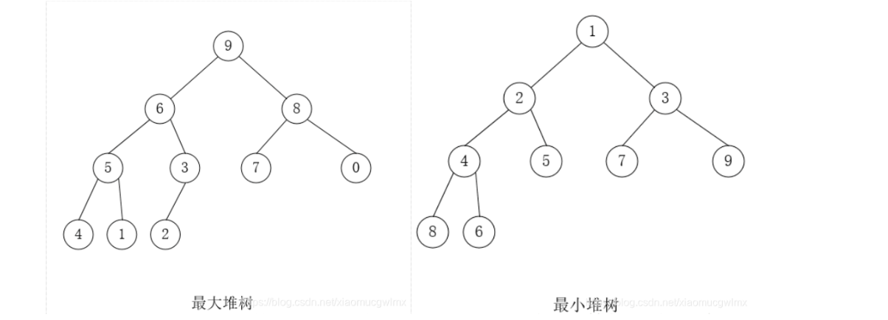
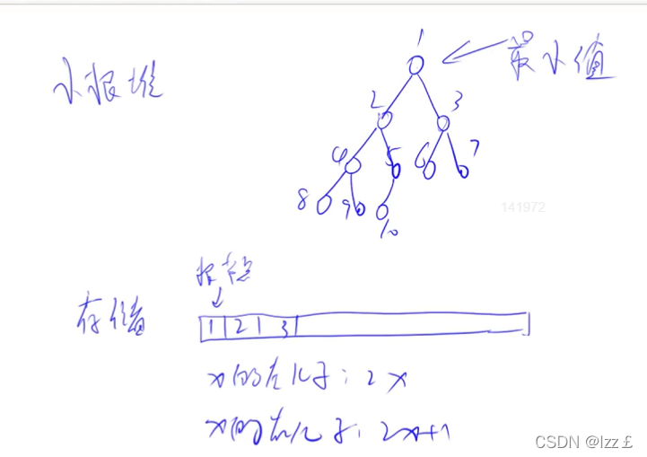

堆排序的基础知识
堆的性质
    1.堆中某个节点的值总是不大于或不小于其父节点的值;下标从1开始：(ki <= k2i,ki <= k2i+1)或者(ki >= k2i,ki >= k2i+1), {i = 1,2,3,4...n}
                                            下标从0开始：(ki <= k2i+1,ki <= k2i+2)或者(ki >= k2i+1,ki >= k2i+2), {i = 0,1,2,3,4...n}
    2.堆总是一棵完全二叉树。
    3.根节点最大的堆叫做最大堆或大根堆，根节点最小的堆叫做最小堆或小根堆
        
    4.堆是非线性数据结构，相当于一维数组，有两个直接后继。
    5.左右孩子关系
        
    6.左后一个非叶子节点：(n - 2) / 2
二叉树的基础知识
    1.完全二叉树是指，除了最底层之外，其他层都是满的，并且最底层的所有节点都集中在树的左侧。
    2.满二叉树是指，每个非叶子节点都有两个子节点，并且所有叶子节点都在同一层上。具体地说，如果一棵二叉树有深度h，且有2^h-1个节点，那么这棵二叉树就是满二叉树。